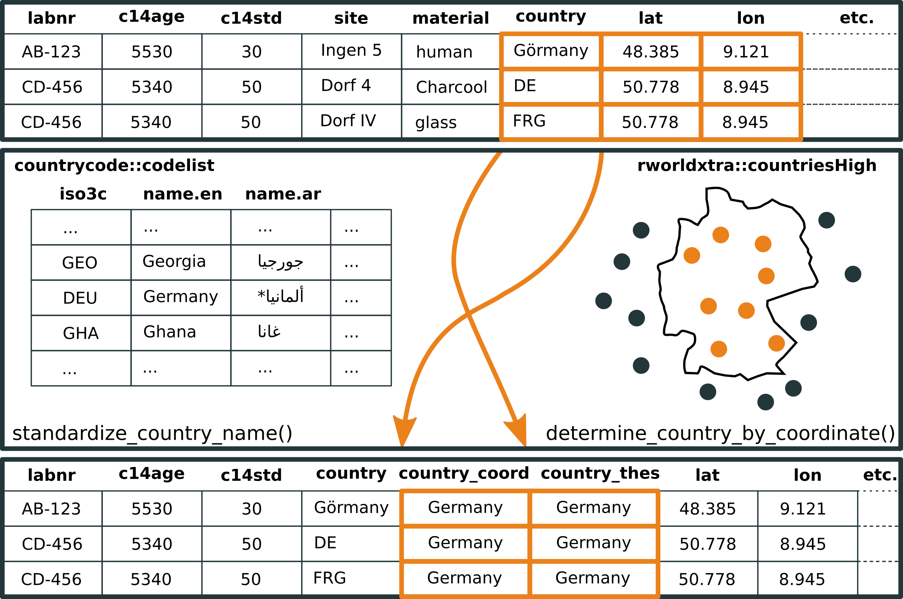
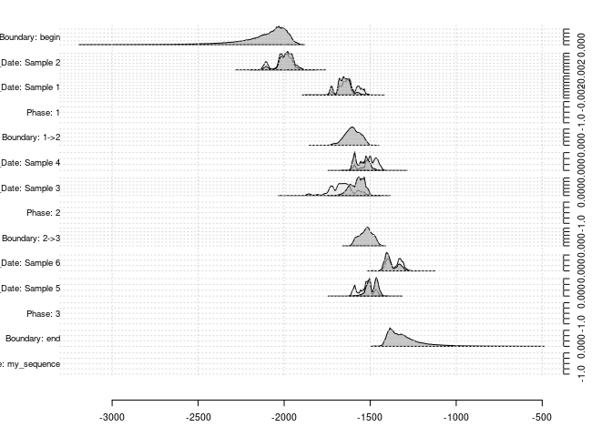

```{r, echo = FALSE}
# https://stackoverflow.com/questions/25646333/code-chunk-font-size-in-rmarkdown-with-knitr-and-latex
def.chunk.hook  <- knitr::knit_hooks$get("chunk")
knitr::knit_hooks$set(chunk = function(x, options) {
  x <- def.chunk.hook(x, options)
  ifelse(options$size != "normalsize", paste0("\\", options$size,"\n\n", x, "\n\n \\normalsize"), x)
})
```

## \textsuperscript{14}C: The backbone of absolute chronology

- ^14^C has revolutionized the previous typology-based chronology
- only the calibration made the method useful as a tool for absolute chronology
- thanks to Bayesian statistics, accuracy now reaches the level of generations
- ^14^C data are gold standard today for much of the (pre-)history
- no archaeologist can work meaningfully at present without using 14C data

{height=33%} {height=33%} {height=33%} {height=33%}

## c14bazAAR & oxcAAR

\begin{columns}
\begin{column}{0.48\textwidth}
\textbf{c14bazAAR}

R package for \textbf{download} and \textbf{preparation} of \textsuperscript{14}C dates from different source databases

\

\includegraphics{../images/smartart_c14bazAAR_package.png}

\end{column}
\begin{column}{0.48\textwidth}
\textbf{oxcAAR}

R package API to OxCal for reproducible \textsuperscript{14}C \textbf{calibration}, \textbf{sequencing} and \textbf{simulation}

\

\includegraphics{../images/smartart_oxcAAR_package.png}

\end{column}
\end{columns}

# c14bazAAR

## A thousand databases

**14SEA**: 14C database for Southeast Europe and Anatolia (10,000–3000 calBC) \
**aDRAC**: Archives des datations radiocarbone d'Afrique centrale \
**AustArch**: Database of 14C and Luminescence Ages from Archaeological Sites in Australia. \
**Banadora**: Banque nationale de données radiocarbone. \
**CalPal**: Radiocarbon Database of the CalPal software package. \
**CARD**: Canadian Archaeological Radiocarbon Database. \
**CONTEXT**: Collection of radiocarbon dates from sites in the Near East and neighboring regions (20.000 - 5.000 calBC). \
**Euroevol**: Cultural Evolution of Neolithic Europe Dataset. \
**INQUA**: Radiocarbon Palaeolithic Europe Database. \
**Ibercrono**: Cronometrías Para la Historia de la Península Ibérica. \
**KITE East Africa**: Radiocarbon dates from eastern Africa in the CARD2.0 format. \
**PPND**: The platform for neolithic radiocarbon dates. \
**RADON**: Central European and Scandinavian database of \textsuperscript{14}C dates for the Neolithic and Early Bronze Age. \ \
**...**

## Idea
 c14bazAAR is a R package to **download**, **merge** and **prepare** \textsuperscript{14}C dates from **different source databases**
 
```{r eval = FALSE}
# basic workflow
get_dates() %>%           # get dates
  ...() %>%               
  calibrate() %>%         # apply some data preparation tools
  ...() %>%
  ...() -> list_of_dates  # get a nice date list for your research
```

- User perspective
    - access many highly different databases with one interface
    - reproducibility with scripted data selection
    - standard data structures for direct access to powerful R tools (tidyverse)
- Developer perspective
    - Open Source: examine & improve the implementation and adjust everything for your needs
    - simple parser development framework to add further databases
    - embed bulk c14 dates into your own application
    
c14bazAAR is the backend of a \textsuperscript{14}C dates search engine: \textbf{\url{www.neolithicRC.de}}

## Common data structure: The c14_date_list S3 class

```{r size = "small"}
c14bazAAR::get_aDRAC()
```

## Common data structure: The c14_date_list S3 class

c14_date_list ...

- ... is a modified **tibble**/data.frame
- ... has a set of **predefined variables** -- essence of source databases

\definecolor{ori}{rgb}{0.9215686,0.5058824,0.1058824} 

| **general information** | **location**          | **archaeological context**      | **sample analysis**           |             
| :---:                   | :-----:               | :-----------:                   | :----:                        |
| labnr                   | region                | period                          | \textbf{\color{ori}{c14age}}  |
| sourcedb                | country               | culture                         | \textbf{\color{ori}{c14std}}  |
| method                  | lat                   | sitetype                        | c13val                        |
| shortref                | lon                   | feature                         | material                      |
| comment                 | site                  |                                 | species                       |    

See `c14bazAAR::variable_reference` for the documentation how variables from different databases are related.

- ... provides **own class methods**

## Features -- calibration


## Features -- material classification


## Features -- country correction



## Features -- duplicates


## Demotime

# oxcAAR

## Several possibilities for calibration

### outside of R
* CalPal, BCal, CALIB, Fairbanks calibration, OxCal, iosacal, MatCal
* [calibrator](https://github.com/ISAAKiel/calibrator)
* ChronoModel

### within R
* [Bchron](http://cran.rstudio.com/web/packages/Bchron/index.html)
  * { height=5% } Andrew Parnell
* [rcarbon](https://cran.r-project.org/web/packages/rcarbon/index.html)
  * { height=5% } Andrew Bevan
* [oxcAAR](https://cran.r-project.org/web/packages/oxcAAR/index.html)
  * { height=5% } ISAAK

## Motivation

### Why another calibration package?

*1. Every package produces slightly different results*

{height=33%} {height=33%}

*2. Sequential Calibration with other tools (currently) not available*

{width=33%}

## Idea

 oxcAAR is a R package to **calibrate**, **simulate** and **sum** \textsuperscript{14}C dates using **OxCal** as calibration engine

```{r echo = FALSE, message=FALSE}
if(!require('devtools')) install.packages('devtools')
library(devtools)
install_github('ISAAKiel/oxcAAR')
library(oxcAAR)
library(dplyr)
```

```{r message=FALSE, size = 'tiny'}
quickSetupOxcal() # download Oxcal to tempory folder
oxcalCalibrate( bp=5000, std=20) # do the calibration
```

## Accessing the calibration result - structure

```{r message=FALSE, size = 'tiny'}
my_cal_date <- oxcalCalibrate( bp=5000, std=20)
str(my_cal_date, max.level = 3)
```

## Accessing the calibration result - for basic plot

```{r message=FALSE, size = 'tiny', out.height = "50%", fig.align = "center"}
plot(
  my_cal_date$`1`$raw_probabilities$dates,
  my_cal_date$`1`$raw_probabilities$probabilities,
  type = "l", xlab = "years", ylab = "probs"
  )
```

## Features - plotting an individual date

Plotting an individual date

```{r message=FALSE, size = 'tiny', out.height = "75%", fig.align = "center"}
oxcalCalibrate( bp=5000, std=20) %>% plot()
```

## Features - plotting multiple dates

```{r message=FALSE, size = 'tiny', out.height = "75%", fig.align = "center"}
oxcalCalibrate( bp=c(5000,5200), std=c(20,25)) %>% plot()
```

## Features - plotting on the calibration curve

```{r message=FALSE, size = 'tiny', out.height = "75%", fig.align = "center"}
oxcalCalibrate( bp=c(5000,5200), std=c(20,25)) %>% calcurve_plot()
```

## Whatnot

## Demotime

## Projekt Timeline


**Clemens Schmid**                   
clemens@nevrome.de  

**Martin Hinz**              
martin.hinz@ufg.uni-kiel.de

