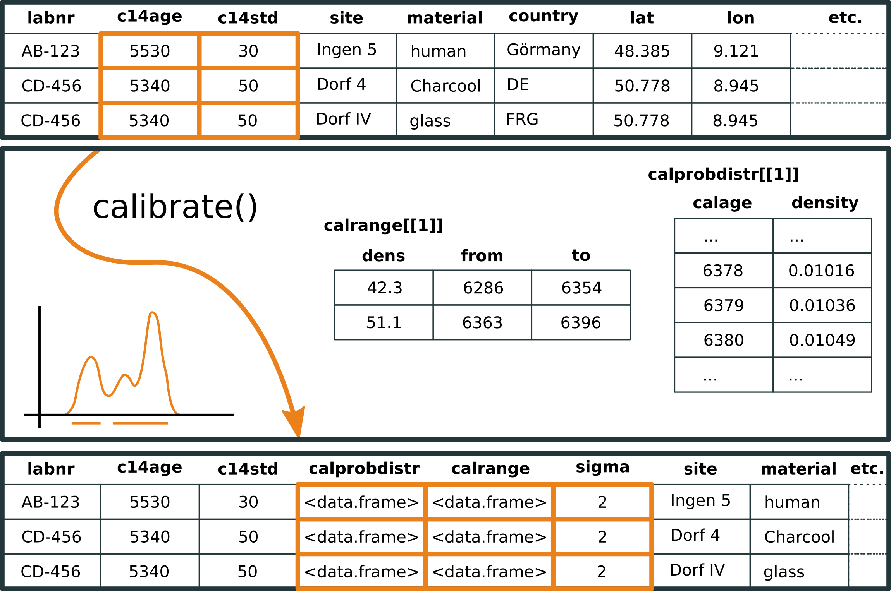
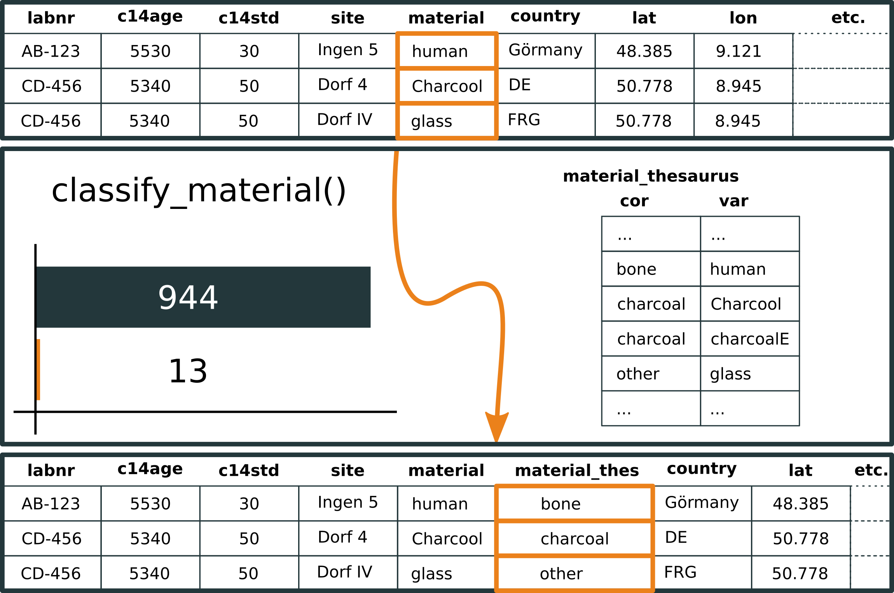
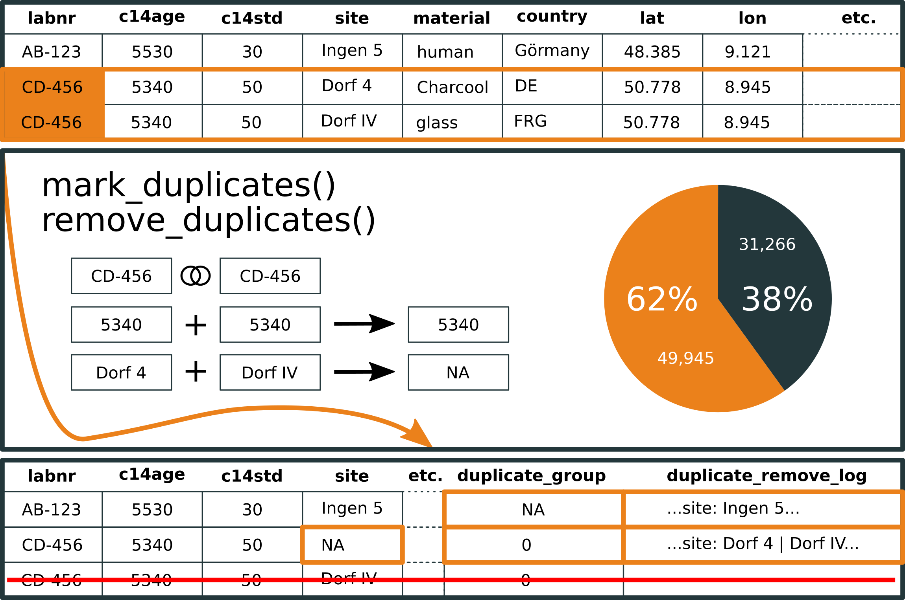

```{r, echo = FALSE}
# https://stackoverflow.com/questions/25646333/code-chunk-font-size-in-rmarkdown-with-knitr-and-latex
def.chunk.hook  <- knitr::knit_hooks$get("chunk")
knitr::knit_hooks$set(chunk = function(x, options) {
  x <- def.chunk.hook(x, options)
  ifelse(options$size != "normalsize", paste0("\\", options$size,"\n\n", x, "\n\n \\normalsize"), x)
})
knitr::opts_chunk$set(echo = TRUE, cache = TRUE)
```

## \textsuperscript{14}C: The backbone of absolute chronology

- ^14^C dating with calibration has **revolutionized** the previous typology-based **chronology** in many branches of archaeology
- thanks to **Bayesian statistics**, **Monte-Carlo simulation** and **seriation based models**, **accuracy** now reaches the **level of generations**
- ^14^C data are **gold standard** today for much of the (pre-)history: almost no archaeologist can work meaningfully at present without using ^14^C data

\begin{figure}
\captionsetup[subfigure]{labelformat=empty}
\centering
\subfloat[]{\includegraphics[height=1.3in]{../images/childe.png}}
\subfloat[]{\includegraphics[width=1in, height=1.3in]{../images/libby_a.png}}
\subfloat[]{\includegraphics[height=1.3in]{../images/migrated_Renfrew__Colin_0.jpg}}
\subfloat[]{\includegraphics[height=1.3in]{../images/Thomas_Bayes.png}}
\end{figure} 

## c14bazAAR & oxcAAR

\begin{columns}
\begin{column}{0.48\textwidth}
\textbf{c14bazAAR}

R package for \textbf{download} and \textbf{preparation} of \textsuperscript{14}C dates from different source databases

\

\includegraphics{../images/smartart_c14bazAAR_package.png}

\end{column}
\begin{column}{0.48\textwidth}
\textbf{oxcAAR}

R package API to OxCal for reproducible \textsuperscript{14}C \textbf{calibration}, \textbf{sequencing} and \textbf{simulation}

\

\includegraphics{../images/smartart_oxcAAR_package.png}

\end{column}
\end{columns}

# c14bazAAR

## A thousand databases

**14SEA**: ^14^C database for Southeast Europe and Anatolia (10,000–3000 calBC) \
**aDRAC**: Archives des datations radiocarbone d'Afrique centrale \
**AustArch**: Database of ^14^C and Luminescence Ages from Archaeological Sites in Australia. \
**Banadora**: Banque nationale de données radiocarbone. \
**CalPal**: Radiocarbon Database of the CalPal software package. \
**CARD**: Canadian Archaeological Radiocarbon Database. \
**CONTEXT**: Collection of radiocarbon dates from sites in the Near East and neighboring regions (20.000 - 5.000 calBC). \
**Euroevol**: Cultural Evolution of Neolithic Europe Dataset. \
**INQUA**: Radiocarbon Palaeolithic Europe Database. \
**Ibercrono**: Cronometrías Para la Historia de la Península Ibérica. \
**KITE East Africa**: Radiocarbon dates from eastern Africa in the CARD2.0 format. \
**PPND**: The platform for neolithic radiocarbon dates. \
**RADON**: Central European and Scandinavian database of \textsuperscript{14}C dates for the Neolithic and Early Bronze Age. \ \
**...**

## Idea
 c14bazAAR is a R package to **download**, **merge** and **prepare** \textsuperscript{14}C dates from **different source databases**
 
```{r eval = FALSE}
# basic workflow
get_dates() %>%           # get dates
  ...() %>%               
  calibrate() %>%         # apply some data preparation tools
  ...() %>%
  ...() -> list_of_dates  # get a nice date list for your research
```

- User perspective
    - access many highly different databases with **one interface**
    - **reproducibility** with scripted data selection
    - standard data structure for direct access to powerful R tools (**tidyverse**)
- Developer perspective
    - **Open Source**: examine & improve the implementation and adjust everything for your needs
    - simple **parser** development framework to add further databases
    - embed bulk ^14^C dates into **your own application**
    
c14bazAAR stocks a \textsuperscript{14}C dates search engine: \LARGE{\textbf{\url{www.neolithicRC.de}}}

## Common data structure: The c14_date_list S3 class

```{r size = "small"}
c14bazAAR::get_aDRAC()
```

## Common data structure: The c14_date_list S3 class

c14_date_list ...

- ... is a modified **tibble**/data.frame
- ... has a set of **predefined variables** -- essence of source databases

\definecolor{ori}{rgb}{0.9215686,0.5058824,0.1058824} 

| **general information** | **location**          | **archaeological context**      | **sample analysis**           |             
| :---:                   | :-----:               | :-----------:                   | :----:                        |
| labnr                   | region                | period                          | \textbf{\color{ori}{c14age}}  |
| sourcedb                | country               | culture                         | \textbf{\color{ori}{c14std}}  |
| method                  | lat                   | sitetype                        | c13val                        |
| shortref                | lon                   | feature                         | material                      |
| comment                 | site                  |                                 | species                       |    

See `c14bazAAR::variable_reference` for the documentation how variables from different databases are related.

- ... provides **own class methods**

## Features -- calibration



## Features -- material classification



## Features -- country correction


## Features -- duplicates



## Demotime

```{r, eval = FALSE, size = 'LARGE'}
library(magrittr)

c14bazAAR::get_all_dates() %>%
  # dplyr::sample_n(500) %>%
  # c14bazAAR::as.c14_date_list() %>%
  c14bazAAR::calibrate(
    choices = c("calprobdistr", "calrange")
  ) %>%
  c14bazAAR::classify_material() %>%
  c14bazAAR::finalize_country_name() %>% 
  c14bazAAR::mark_duplicates() %>%
  dplyr::arrange(dplyr::desc(c14age))
```

# oxcAAR

## Several possibilities for calibration

### outside of R
* CalPal, BCal, CALIB, Fairbanks calibration, OxCal, iosacal, MatCal
* [calibrator](https://github.com/ISAAKiel/calibrator)
* ChronoModel

### within R
* { height=5% } Andrew Parnell:  [**Bchron**](http://cran.rstudio.com/web/packages/Bchron/index.html)

```{r, eval = FALSE}
Bchron::BchronCalibrate(5000, 30, calCurves = "intcal13")
```

* { height=5% } Andrew Bevan:  [**rcarbon**](https://cran.r-project.org/web/packages/rcarbon/index.html)
  
```{r, eval = FALSE}
rcarbon::calibrate(5000, 30)
```

* { height=5% } ISAAK:  [**oxcAAR**](https://cran.r-project.org/web/packages/oxcAAR/index.html)

```{r, eval = FALSE}
oxcAAR::oxcalCalibrate(5000, 30)
```

## Motivation: Why another calibration package?

1. Every package produces **slightly different results**

{height=33%} {height=33%}

2. **Sequential calibration** with other tools (currently) not available

{width=33%}

## Idea

 oxcAAR is a R package to **calibrate**, **simulate** and **sum** \textsuperscript{14}C dates using **OxCal** as calibration engine

```{r echo = FALSE, message=FALSE}
if(!require('devtools')) install.packages('devtools')
library(devtools)
install_github('ISAAKiel/oxcAAR')
library(oxcAAR)
library(dplyr)
```

```{r message=FALSE, size = 'tiny'}
quickSetupOxcal()                # download Oxcal to tempory folder
oxcalCalibrate( bp=5000, std=20) # do the calibration
```

## Accessing the calibration result - structure

```{r message=FALSE, size = 'tiny'}
my_cal_date <- oxcalCalibrate( bp=5000, std=20)
str(my_cal_date, max.level = 3)
```

## Accessing the calibration result - for basic plot

```{r message=FALSE, size = 'tiny', out.height = "50%", fig.align = "center"}
plot(
  my_cal_date$`1`$raw_probabilities$dates,
  my_cal_date$`1`$raw_probabilities$probabilities,
  type = "l", xlab = "years", ylab = "probs"
)
```

## Features - plotting an individual date

Plotting an individual date

```{r message=FALSE, size = 'tiny', out.height = "75%", fig.align = "center"}
oxcalCalibrate( bp=5000, std=20) %>% plot()
```

## Features - plotting multiple dates

```{r message=FALSE, size = 'tiny', out.height = "75%", fig.align = "center"}
oxcalCalibrate( bp=c(5000,5200), std=c(20,25)) %>% plot()
```

## Features - plotting on the calibration curve

```{r message=FALSE, size = 'tiny', out.height = "75%", fig.align = "center"}
oxcalCalibrate( bp=c(5000,5200), std=c(20,25)) %>% calcurve_plot()
```

## Features - simulating a R_Date

```{r message=FALSE, size = 'tiny', out.height = "75%", fig.align = "center"}
oxcalSimulate(-3400, 25, "SimDate_1") %>% plot()
```

## Features - simulating a sum calibration

```{r message=FALSE, size = 'tiny', out.height = "50%", fig.align = "center"}
oxcalSumSim(
  timeframe_begin = -4000,      # From when
  timeframe_end = -3000,        # To when
  n = 50,                       # Number of dates
  stds = 35,                    # Standard deviation of dates (can also be a vector of length n)
  date_distribution = "uniform" # random uniform; alternatively: equidist for equidistant dates
) %>% plot()
```

## Features - injecting arbitray OxCal code

```{r message=FALSE, size = 'tiny', out.height = "50%", fig.align = "center"}
my_sequence <- Sequence(
  c(
    Boundary("begin"),
    Phase(
      R_Date(
        c("ABC-123", "ABC-321"),
        c(5020, 5200),
        20), "first"
    ),
    Boundary("between"),
    Phase(
      R_Date(
        c("CBA-123","CBA-321"),
        c(5010, 4810),
        20), "second"
    ),
    Boundary("end")
  ), "my_sequence"
)
cat(my_sequence)
```

## Features - using Bayesian calibration of OxCal

```{r message=FALSE, size = 'tiny', out.height = "50%", fig.align = "center"}
my_result_data  <- my_sequence %>%
  executeOxcalScript() %>%
  readOxcalOutput() %>%
  parseOxcalOutput(only.R_Date = F)

plot(my_result_data)
```

## State and Roadmap

* c14bazAAR
  * Ready for takeoff at Github
    * [https://github.com/ISAAKiel/c14bazAAR](https://github.com/ISAAKiel/c14bazAAR)
    * CRAN release within this month
* oxcAAR
  * oxcAAR 1.0.0 'Nicola' released at CRAN
  * Bayesian Calibration available at Github
    * [https://github.com/ISAAKiel/oxcAAR](https://github.com/ISAAKiel/oxcAAR)
  * oxcAAR 1.1.0 'Flora'
    * CRAN release within this month

## Thank you for your attention


**Clemens Schmid**                   
clemens@nevrome.de  

**Martin Hinz**              
martin.hinz@ufg.uni-kiel.de

